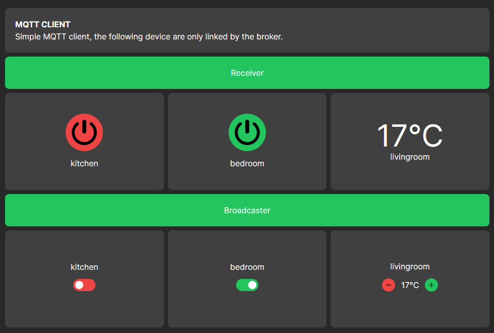

# Overview

I created this simple MQTT Client to test the protocol. In this project, devices and switches are not linked by logic; instead, they communicate exclusively through the MQTT broker.

## Screenshot



## Getting Started

1. Install the project

    ```bash
    npm install
    ```

2. Run the development server

    ```bash
    npm run dev
    # or
    yarn dev
    # or
    pnpm dev
    # or
    bun dev
    ```

3. Open [http://localhost:3000](http://localhost:3000) in your browser to see the result.
